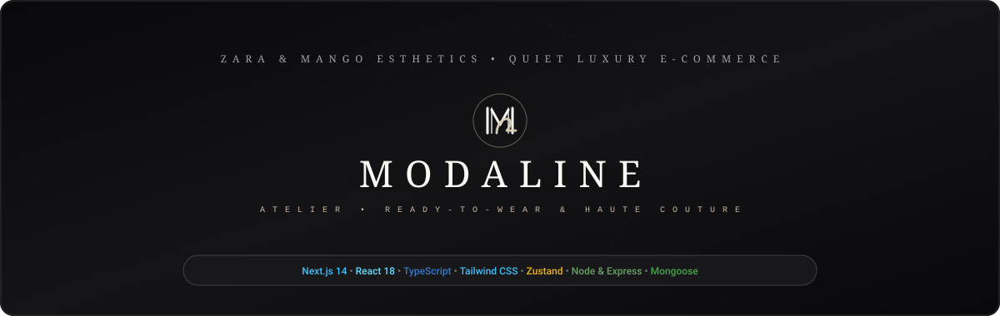
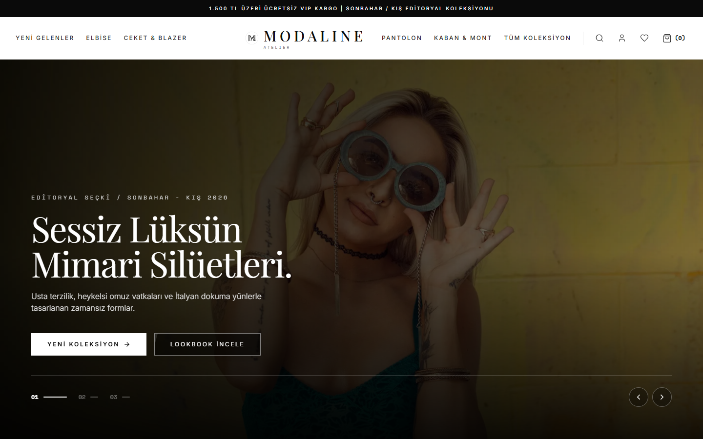
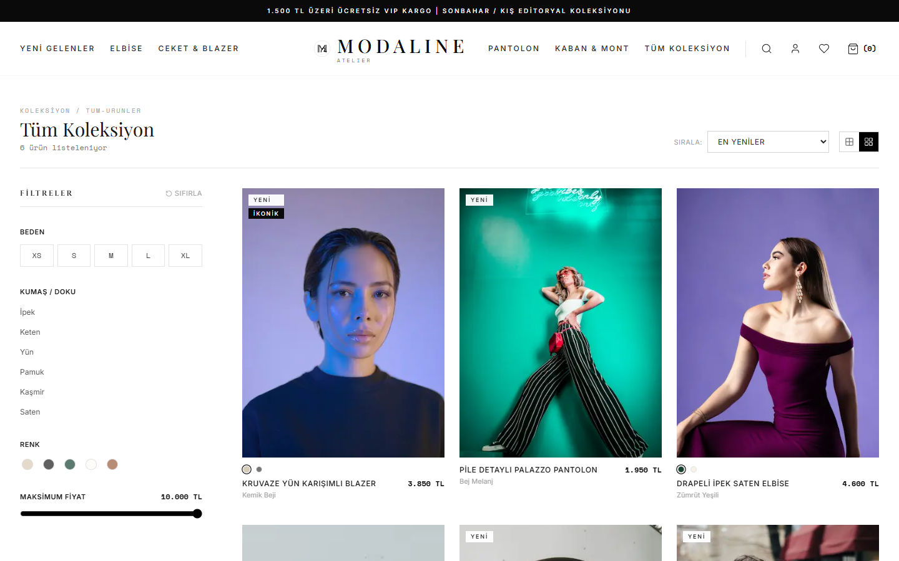
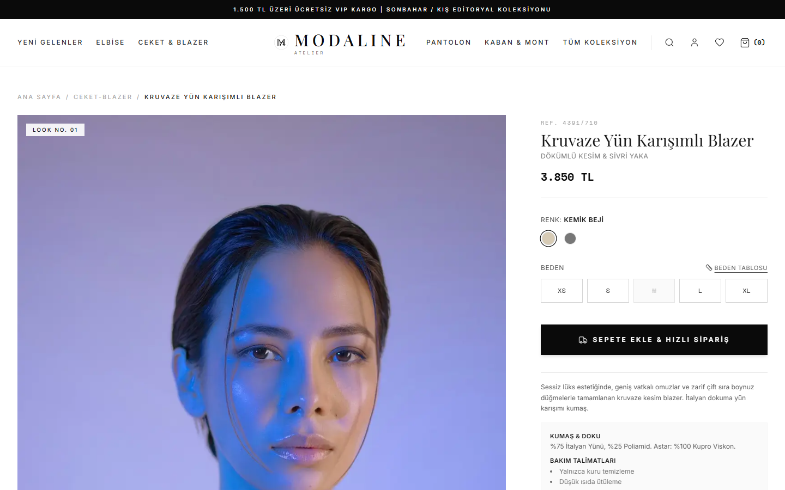
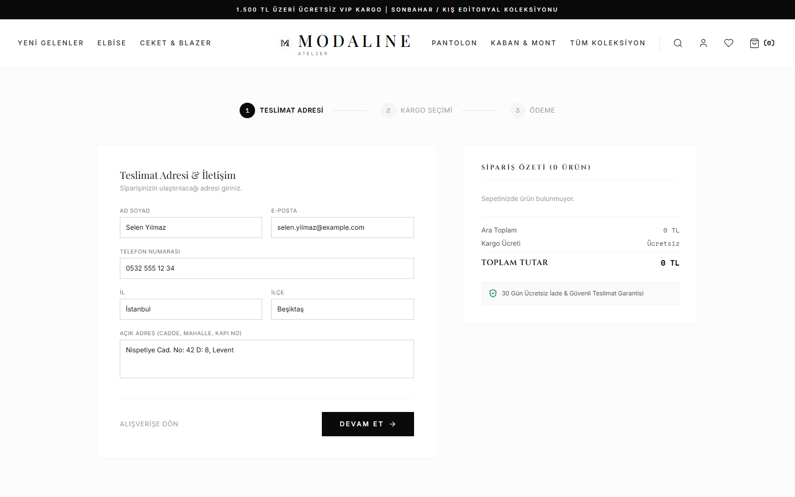
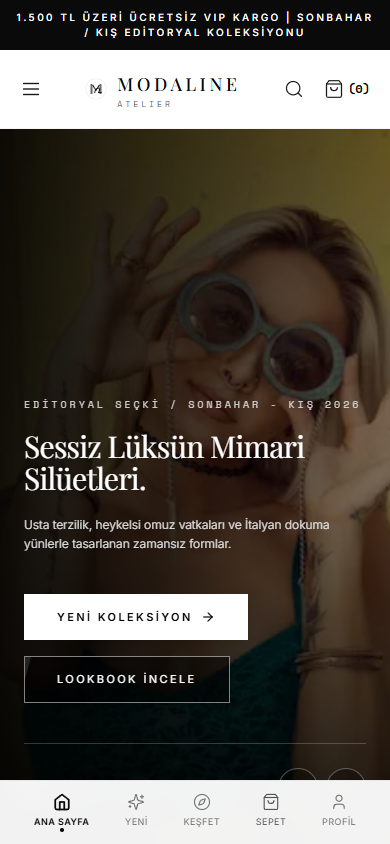

<div align="center">

  

  <br />
  <br />

  <h1>MODALINE ATELIER</h1>
  <p><strong>Kadın Giyim Odaklı Sessiz Lüks (Quiet Luxury) &amp; Editoryal E-Ticaret Deneyimi</strong></p>

  <p>
    <em>Zara, Massimo Dutti ve Mango estetiğinde; minimalist tipografi, heykelsi silüetler, editoryal görseller ve akıcı kullanıcı deneyimiyle tasarlanmış modern Full-Stack Monorepo e-ticaret platformu.</em>
  </p>

  <p>
    <a href="https://nextjs.org/"></a>
    <a href="https://react.dev/"></a>
    <a href="https://www.typescriptlang.org/"></a>
    <a href="https://tailwindcss.com/"></a>
    <a href="https://expressjs.com/"></a>
    <a href="https://zustand-demo.pmnd.rs/"></a>
    <a href="LICENSE"></a>
  </p>

  <p>
    <a href="#-proje-sayfaları-ve-ekran-görüntüleri">Ekran Görüntüleri</a> •
    <a href="#-temel-özellikler">Özellikler</a> •
    <a href="#-mimari-ve-klasör-yapısı">Mimari</a> •
    <a href="#-kurulum-ve-çalıştırma">Kurulum</a> •
    <a href="#-api-dokümantasyonu">API</a> •
    <a href="#-teknoloji-yığını">Teknolojiler</a>
  </p>

</div>

---

## 📖 Proje Hakkında

**ModaLine Atelier**, geleneksel karmaşık e-ticaret sitelerinin yarattığı görsel gürültüyü ortadan kaldıran; temiz boşluklar, editoryal moda fotoğrafçılığı ve rafine mikro etkileşimlerle premium bir alışveriş atmosferi sunan yeni nesil bir web uygulamasıdır.

Proje, kurumsal ölçeklenebilirlik prensiplerine uygun olarak **Next.js 14 App Router** frontend ve **Express.js / Node.js** backend katmanlarını tek bir **Monorepo** çatısı altında birleştirir.

> [!TIP]
> **Sıfır Bağımlılıkla Anında Çalışma:** Backend veri tabanı (MongoDB) kurulu olmasa bile yerleşik akıllı veri tohumlayıcı (fallback dataset) devreye girerek tüm e-ticaret akışını (ürün listeleme, filtreleme, sepet, ödeme simülasyonu) anında ve kesintisiz deneyimlemenizi sağlar.

---

## 📸 Proje Sayfaları ve Ekran Görüntüleri

Aşağıda ModaLine Atelier platformunun gerçek ekran görüntüleri ve sayfa işlevleri yer almaktadır:

### 1. Ana Sayfa (Editorial Showcase & Hero)
*Büyük editoryal vitrin slaytları, trend koleksiyonlar, sessiz lüks felsefesi ve zarif marka tipografisi.*

<div align="center">
  
</div>

<br />

### 2. Koleksiyon & Ürün Listeleme (PLP - Product Listing Page)
*Sol yapışkan (sticky) Beden, Kumaş, Renk ve Fiyat filtreleri; 2'li ve 4'lü dinamik ızgara görünüm anahtarı; anlık sıralama seçenekleri.*

<div align="center">
  
</div>

<br />

### 3. Ürün Detay Sayfası (PDP - Product Detail Page)
*Seçilen renge göre dinamik güncellenen yüksek çözünürlüklü editoryal görsel galerisi, stok matrisi, beden seçici, kumaş/bakım kompozisyonu ve "Kombini Tamamla" çapraz satış önerileri.*

<div align="center">
  
</div>

<br />

### 4. Güvenli Ödeme & Checkout Akışı
*Sayfadan ayrılmadan açılan akıcı Sepet Çekmecesi (Cart Sheet), 1.500 TL üzeri ücretsiz kargo baremi ilerleme çubuğu, 3 adımlı sipariş/teslimat/ödeme formu.*

<div align="center">
  
</div>

<br />

### 5. Mobil Deneyim (Mobile-First Architecture)
*Akıllı telefonlar için optimize edilmiş dokunmatik menü, mobil filtre çekmecesi, hızlı sepet kontrolü ve alt navigasyon çubuğu.*

<div align="center">
  
</div>

---

## ✨ Temel Özellikler

### 👗 Frontend Deneyimi (`apps/web`)
- **Next.js 14 App Router:** Hızlı sayfa geçişleri, optimize edilmiş görsel yükleme (`next/image`) ve SEO dostu meta etiketleri.
- **Sessiz Lüks Tasarım Dili:** Haute Couture monogram logo, `Playfair Display`, `Cinzel` ve `Inter` font kombinasyonları, monokrom renk paleti.
- **Zustand Tabanlı Durum Yönetimi:**
  - `useCartStore`: Yerel depolama (Local Storage) ile kalıcı hale getirilmiş sepet durumu.
  - `useFilterStore`: Kategori, beden, kumaş, renk ve fiyat filtreleri senkronizasyonu.
- **Dinamik Sepet Çekmecesi (Cart Sheet):** Sayfa değiştirmeden sağdan kayarak açılan sepet arayüzü ve 1.500 TL ücretsiz kargo ilerleme çubuğu.
- **Çok Boyutlu Varyant Matrisi:** Renk, beden ve stok bilgilerinin tek merkezden yönetildiği e-ticaret yapısı.
- **Kombini Tamamla (Cross-Selling):** Ürün sayfalarında uyumlu parçaları öneren akıllı ilişkilendirme sistemi.
- **3 Adımlı Sipariş Akışı:** Teslimat bilgileri, kargo şirketi seçimi (Yurtiçi, Kolay Gelsin, VIP Özel Kurye) ve 3D Secure kartlı ödeme simülasyonu.

### ⚙️ Backend Mimarisi (`apps/api`)
- **Express.js & TypeScript:** Modüler rotalar (`routes`), controller mantığı ve katmanlı mimari.
- **Esnek Veri Tabanı Katmanı:** Mongoose şemaları üzerinden MongoDB desteği + otomatik In-Memory tohumlayıcı (MongoDB çalışmasa dahi tam işlevsellik).
- **RESTful Endpoints:** Ürün listeleme, slug bazlı ürün detayı, tohumlama (seed) ve sipariş oluşturma API uç noktaları.
- **CORS & Güvenlik:** İstemci ve sunucu arasında optimize edilmiş güvenlik ve istek başlıkları.

---

## 📁 Mimari ve Klasör Yapısı

```text
Modaline/
├── apps/
│   ├── web/                        # Next.js 14 Frontend Uygulaması
│   │   ├── src/
│   │   │   ├── app/                # App Router Sayfaları
│   │   │   │   ├── page.tsx        # Ana Sayfa (Editorial Hero & Showcase)
│   │   │   │   ├── collections/    # PLP: Koleksiyon ve Filtreleme Sayfaları
│   │   │   │   ├── products/       # PDP: Ürün Detay & Varyant Matrisi
│   │   │   │   ├── checkout/       # 3 Adımlı Sipariş & Ödeme Formu
│   │   │   │   ├── layout.tsx      # Global Sayfa Şablonu (Header & Footer)
│   │   │   │   └── globals.css     # Tailwind & Özel Stil Tanımları
│   │   │   ├── components/
│   │   │   │   ├── cart/           # CartSheet ve Sepet Bileşenleri
│   │   │   │   ├── home/           # HeroSection ve Editoryal Bannerlar
│   │   │   │   ├── layout/         # Header, Footer, Mobil Navigasyon
│   │   │   │   ├── product/        # ProductCard, QuickViewModal, SizeGuide
│   │   │   │   └── ui/             # ModaLineLogo ve Monogram SVG İkonları
│   │   │   ├── store/              # useCartStore & useFilterStore (Zustand)
│   │   │   ├── lib/                # API İstemcisi, Formatlayıcılar & Araçlar
│   │   │   └── types/              # TypeScript Tipleri ve Veri Modelleri
│   │   ├── tailwind.config.ts      # Özel Tasarım Sistemi ve Renk Tanımları
│   │   └── package.json
│   │
│   └── api/                        # Express.js REST API Backend
│       ├── src/
│       │   ├── controllers/        # productController, orderController
│       │   ├── data/               # seedData.ts (Yerleşik Tohum Verileri)
│       │   ├── models/             # Mongoose Product ve Order Şemaları
│       │   ├── routes/             # productRoutes, orderRoutes
│       │   └── server.ts           # Express Sunucusu & Veritabanı Bağlantısı
│       ├── tsconfig.json
│       └── package.json
│
├── docs/                           # Proje Dokümantasyonu & Görseller
│   ├── assets/                     # SVG Banner & Marka Varlıkları
│   └── screenshots/                # HD Sayfa Ekran Görüntüleri (5 Adet)
├── .gitignore                      # Git Dışlama Kuralları
├── LICENSE                         # MIT Lisansı
└── package.json                    # Kök Monorepo Scriptleri
```

---

## 🚀 Kurulum ve Çalıştırma

Projeyi yerel makinenizde çalıştırmak için aşağıdaki adımları izleyin:

### 1. Gereksinimler
- **Node.js:** `v18.17.0` veya daha üstü
- **npm:** `v9.0.0` veya daha üstü
- *(Opsiyonel)* **MongoDB:** Yerel veya MongoDB Atlas bağlantısı (Yoksa in-memory otomatik devreye girer)

### 2. Depoyu Klonlayın
```bash
git clone https://github.com/kullanici-adiniz/modaline.git
cd modaline
```

### 3. Bağımlılıkları Yükleyin
Kök dizinde aşağıdaki komutu çalıştırarak tüm monorepo bağımlılıklarını yükleyin:
```bash
npm install
```

### 4. Ortam Değişkenlerini Ayarlayın (Opsiyonel)
Gerektiğinde örnek `.env.example` dosyalarından faydalanabilirsiniz:
```bash
# Backend için
cp apps/api/.env.example apps/api/.env

# Frontend için
cp apps/web/.env.example apps/web/.env.local
```

### 5. Uygulamayı Başlatın

#### Seçenek A: Frontend'i Başlatma (Varsayılan Port: 3000)
```bash
npm run dev:web
```
Tarayıcınızda açın: **[http://localhost:3000](http://localhost:3000)**

#### Seçenek B: Backend API'yi Başlatma (Varsayılan Port: 5000)
Ayrı bir terminal penceresinde:
```bash
npm run dev:api
```
API servis adresi: **[http://localhost:5000](http://localhost:5000)**

---

## 🔌 API Dokümantasyonu

Backend Express RESTful API aşağıdaki uç noktaları sağlar:

| Metot | Uç Nokta (Endpoint) | Açıklama |
| :--- | :--- | :--- |
| `GET` | `/api/health` | API servis sağlık durumu ve DB bağlantı kontrolü |
| `GET` | `/api/v1/products` | Tüm ürünleri filtreleme parametreleriyle listeler (`category`, `fabric`, `size`, `sort`) |
| `GET` | `/api/v1/products/:slug` | Belirtilen `slug` değerine sahip ürünü ve çapraz satış önerilerini döner |
| `GET` | `/api/v1/products/seed` | Örnek editoryal ürün kataloğunu veritabanına yeniden tohumlar |
| `POST`| `/api/v1/orders` | Yeni sipariş kaydı oluşturur ve sipariş özetini döner |

---

## 🛠 Kullanılabilir npm Scriptleri

Kök dizinde tanımlı olan pratik kısayol komutları:

```bash
# Frontend dev sunucusunu başlatır (Next.js - Port 3000)
npm run dev:web

# Backend API dev sunucusunu başlatır (Express - Port 5000)
npm run dev:api

# Frontend prodüksiyon paketini derler
npm run build:web

# Backend TypeScript derlemesini tamamlar
npm run build:api
```

---

## 🎨 Tasarım Sistemi & Tipografi

ModaLine Atelier, lüks moda evlerinin editoryal kimliğini yansıtan özel bir tasarım sistemine sahiptir:

- **Fontlar:**
  - Başlıklar ve Lüks Vurgular: `Cinzel` & `Playfair Display`
  - Gövde Metinleri ve UI: `Inter`
  - Kod, SKU ve Fiyat İndikatörleri: `JetBrains Mono` / Font Monospace
- **Renk Paleti:**
  - *Noir Black:* `#0E0E0E` (Zarafet ve güç)
  - *Kemik Beji:* `#D7CBB5` (Doğal lüks ve sıcaklık)
  - *Zümrüt Yeşili:* `#174232` (Zengin kış tonu)
  - *Ham Keten:* `#E2D8C9` (Organik doku)
  - *Karina Taba:* `#995C3C` (Zamansız deri ve kaşmir)

---

## 🤝 Katkıda Bulunma (Contributing)

1. Bu depoyu Fork'layın (`Fork` butonuna tıklayın).
2. Yeni bir özellik dalı oluşturun (`git checkout -b feature/harika-ozellik`).
3. Değişikliklerinizi commit edin (`git commit -m 'feat: harika bir özellik eklendi'`).
4. Dalınıza push yapın (`git push origin feature/harika-ozellik`).
5. Bir **Pull Request (PR)** açın.

---

## 📄 Lisans

Bu proje [MIT Lisansı](LICENSE) kapsamında açık kaynak olarak lisanslanmıştır. Detaylar için `LICENSE` dosyasına göz atabilirsiniz.

<div align="center">
  <sub>ModaLine Atelier © 2026. Sevgi ve estetik tutkusuyla hazırlandı.</sub>
</div>
